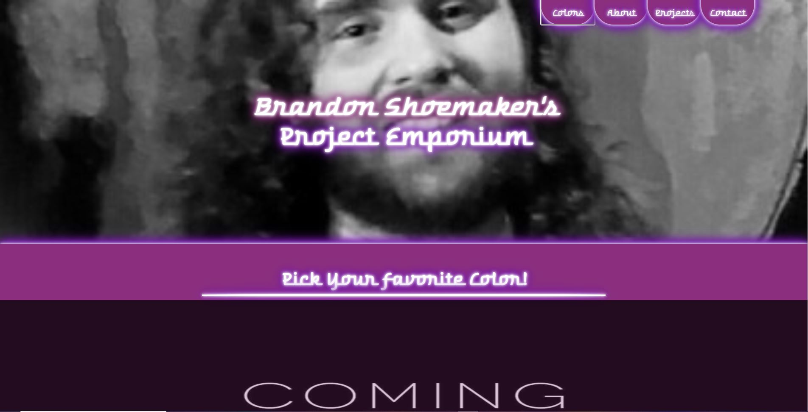
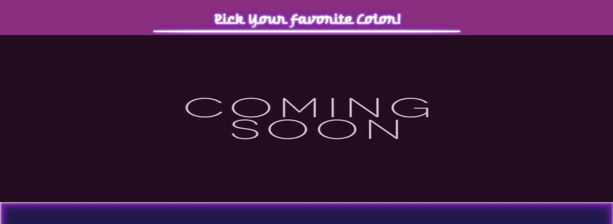
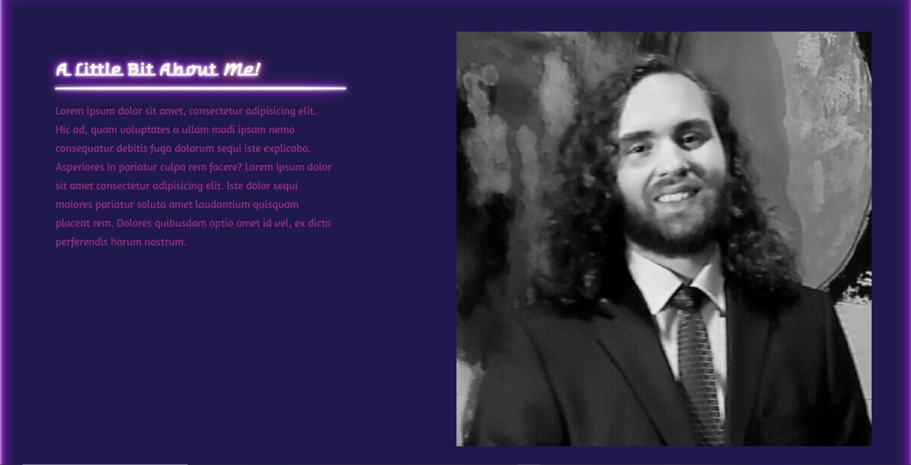
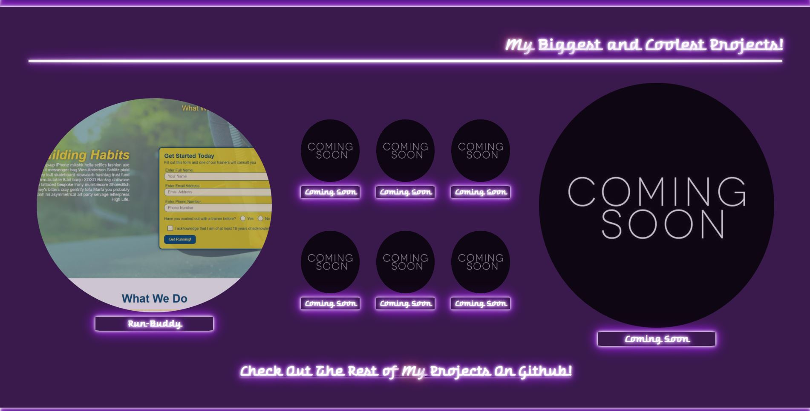
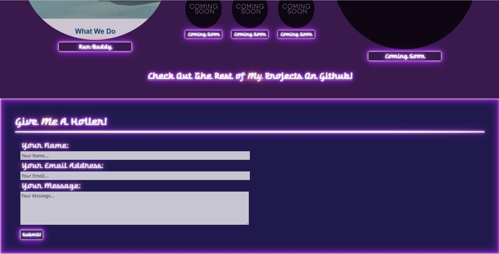

# Personal Portfolio

## Description

The purpose of building this project is of course to serve as a public medium for you, the employer, to see what I'm capable of and what skills I have to offer.

On this personal webpage, there is a handful of major projects that I will have developed, with the most impressive and well developed being in the large circles.
Additionally,you will find that My github link is included at the bottom of the projects section in the form of a title.
 
Lastly, these is a contact form that you may use to contactme if you have any questions or would simply like to say hi. 

### Plans For The Future

I have many plans that I would like to implements, some of which i'm not sure are possible, but I'd sure like to try anyways!

To start I'd like to somehow add a true neon light looking object to the boxes and text. The way it is now looks flat and just 2 dimentional. If possible I'd also like to develop the lights the neon emmits and add a flicker. Adding to that flicker effect, once i've perfected it, I will have the website upon launch to be pitch black and unsequentially have all neon lights illuminate the page.

Next, for more base appearance, I'd like to add a grungey texture to some of the backgrounds to add a texture to the page and further selling the neon look.

Now, for the main feature of the page, I hope to add an RGB scale accross one of the sections of the page that the user can interact with and choose colors off of. Once a color is chosen the page will calculate an analogous color scheme in respect to it and reshade/color the entire website.

Aside from aesthetics, I also wish to simply improve performance all around as a site such as the one I build is sure to be a little bulky.

## Deployed Project

https://brandonshoemaker.github.io/The-Project-Emporium/

## Screenshots 

## Installation

1. Navigate with cd to your desired directory via your GIT bash. 
1,2. (If you don't have GIT bash) Follow this link to download GIT bash and follow their instructions: https://git-scm.com/download/win
2. Once in the desired directory, type the following command: git clone git@github.com:BrandonShoemaker/The-Project-Emporium.git
3. Profit

## Credits

Creator, developer, and designer: Brandon Shoemaker
